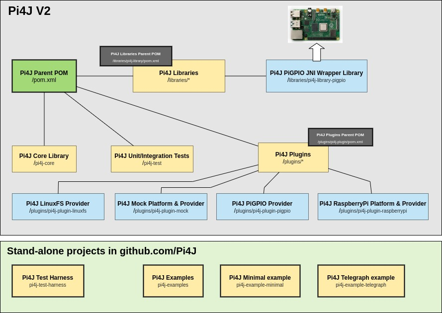

 Pi4J :: Java I/O Library for Raspberry Pi
==========================================================================

Build state: 


Project Map: [](https://sourcespy.com/github/pi4jpi4jv2/)

[](https://join.slack.com/t/pi4j/shared_invite/zt-1ttqt8wgj-E6t69qaLrNuCMPLiYnBCsg)
[](http://www.apache.org/licenses/LICENSE-2.0)
[](https://maven-badges.herokuapp.com/maven-central/com.pi4j/pi4j-core)
[](https://oss.sonatype.org/#nexus-search;gav~com.pi4j~~~~)
[](https://pi4j.com)
[](https://twitter.com/pi4j)

---

## Project Information for V2 of Pi4J

Project website: [pi4j.com](https://pi4j.com/).


* Pi4J V2 Discussions (replacing the Forum) (*new*): [github.com/Pi4J/pi4j-v2/discussions](https://github.com/Pi4J/pi4j-v2/discussions)
* Pi4J V2 issues: [github.com/Pi4J/pi4j-v2/issues](https://github.com/Pi4J/pi4j-v2/issues)

Builds are available from:

*  [Release builds from Maven Central](http://search.maven.org/#search%7Cga%7C1%7Ccom.pi4j)
*  [Snapshot builds from Sonatype OSS](https://oss.sonatype.org/index.html#nexus-search;quick~pi4j)
*  [Pi4J Downloads](https://pi4j.com/download)
*  [APT/PPA Package Repository downloads](https://github.com/Pi4J/download)

Copyright (C) 2012-2021 Pi4J

## Using Pi4J

When you want to use Pi4J in your project, you should definitely check out [the Pi4J website](https://pi4j.com) where you can find a lot of information and many examples! 

For example, for a minimal example to blink a LED ([fully explained here](https://pi4j.com/getting-started/minimal-example-application/)), you need to import the dependencies and use this code:

```java
var pi4j = Pi4J.newAutoContext();

var led = pi4j.digitalOutput().create(PIN_LED);

while (true) {
    if (led.equals(DigitalState.HIGH)) {
        led.low();
    } else {
        led.high();
    }
    Thread.sleep(500);
}
```

## Contributing to Pi4J

For full description of the code structure, how to compile... see
the ["About the code" on our website](https://pi4j.com/architecture/about-the-code/).



### Project Overview

Starting with the Pi4J 2.0 builds, the Pi4J project is prioritizing focus
on providing Java programs access, control and communication with the core
I/O capabilities of the Raspberry Pi platform.

Read all about it on [pi4j.com: "What’s New in 2.0?"](https://pi4j.com/about/new-in-v2/).

### Build Instructions

The Pi4J V2 codebase can be built using [Apache Maven 3.6.x](https://maven.apache.org/). and [Java JDK 11](https://openjdk.java.net/).
The following command can be used to build the Pi4J V2 JARs:

```
mvn clean install
```

Pi4J V2 also includes native libraries that will need to be compiled if you are modifying any native code.
Most users will never need to compile the native libraries as these artifacts are automatically downloaded  
when building the Pi4J JARs from Maven repositories. One of the following commands can be used to build 
the Pi4J V2 JARs and Native Libraries:

```
mvn clean install -Pnative
mvn clean install -Pnative,docker
```

> **NOTE:** A comprehensive set of build instructions can be found in the [Pi4J V2 Documentation](https://pi4j.com/architecture/about-the-code/build-instructions/).

### Adding a feature or solving a problem

If you have and idea to extend and improve Pi4J, please first create a ticket to discuss how 
it fits in the project and how it can be implemented. 

If you find a bug, create a ticket, so we are aware of it and others with the same problem can 
contribute what they already investigated. And the quickest way to get a fix? Try to search for 
the cause of the problem or even better provide a code fix!
    
### Join the team

You want to become a member of the Pi4J-team? Great idea! Send a short message to frank@pi4j.com 
with your experience, ideas, and what you would like to contribute to the project.

## License

 Pi4J Version 2.0 and later is licensed under the Apache License,
 Version 2.0 (the "License"); you may not use this file except in
 compliance with the License.  You may obtain a copy of the License at:
      http://www.apache.org/licenses/LICENSE-2.0

 Unless required by applicable law or agreed to in writing, software
 distributed under the License is distributed on an "AS IS" BASIS,
 WITHOUT WARRANTIES OR CONDITIONS OF ANY KIND, either express or implied.
 See the License for the specific language governing permissions and
 limitations under the License.
  
## Previous Releases

For previous 1.x release notes and source code, please see the [archived V1 GitHub repository](https://github.com/Pi4J/pi4j-v1).

  * **Releases**
    * V1: [github.com/Pi4J/pi4j-v1/releases](https://github.com/Pi4J/pi4j-v1/releases)
    * V2: [github.com/Pi4J/pi4j-v2/releases](https://github.com/Pi4J/pi4j-v2/releases)
  * **Source Code**: 
    * V1: [github.com/Pi4J/pi4j-v1/branches](https://github.com/Pi4J/pi4j-v1/branches)
    * V2: [github.com/Pi4J/pi4j-v2/branches](https://github.com/Pi4J/pi4j-v2/branches)
